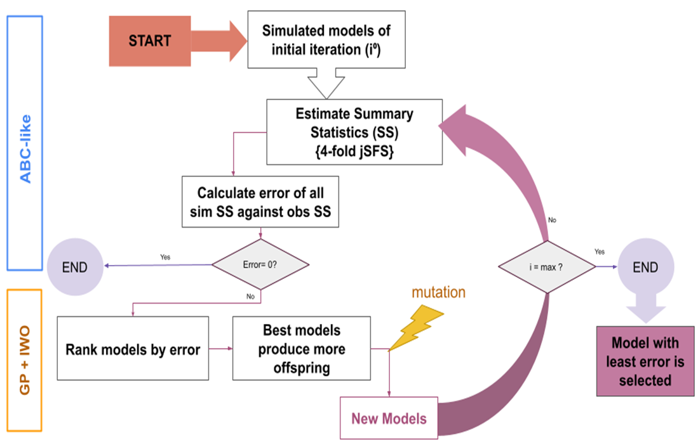

I applied Approximate Bayesian Computations (ABC) techniques with deep learning to develop a model to explain the demographic history of North Africa using whole genome data. We also develop a new software to construct demographic models based on meta-heuristics - [Genetic Programming for Population Genetics (GP4PG)](https://github.com/oscarlao/GP4PG)

<!--more-->

## Introduction

The human demographic history of North Africa is complex, shaped by multiple migration events over time. Evidence of hominid presence in the region dates back 2.4 million years, but the oldest anatomically modern human remains, found at Jebel Irhoud in Morocco, are about 300,000 years old. However, there is no direct continuity between these ancient humans and modern North Africans.

Ancient DNA from individuals at the Taforalt site (15,100–13,900 years ago) suggests a genetic link to the Near Eastern Natufians, supporting a "back-to-Africa" migration. This genetic component persists in modern North African populations, particularly among the Amazigh people. Over time, migrations from the Middle East, Europe, and sub-Saharan Africa have introduced additional genetic influences. The Neolithic expansion, Arabization (7th–11th centuries), the trans-Saharan slave trade, and Mediterranean contacts have all contributed to the genetic diversity of the region.

Linguistically, North Africans are classified into two main groups: the Imazighen (Amazigh/Berbers) and North African Arabs. While Arabization led to cultural and genetic mixing, some Tamazight-speaking groups remained isolated, retaining distinct genetic traits. Despite this, overall genetic differences between Arab and Amazigh populations are minimal.

Due to this extensive genetic heterogeneity, reconstructing North African demographic history is challenging. The study aims to develop a demographic model for the region, focusing on the origins, admixture events, and shared histories of Amazigh and Arab populations. Using computational methods like Approximate Bayesian Computation (ABC-DL) and a new Genetic Programming for Population Genetics (GP4PG) approach, the researchers seek to create a more accurate model of North Africa's genetic and demographic evolution.

## Main task in the project

- Variant calling of high coverage whole genome samples of North African population
- PCA & ADMIXTURE analysis of samples - plink, fastpca, EIGENSOFT, ADMIXTURE
- Build several demographic models to explain the demographic history of North Africa -fastSimcoal2
- Apply deep learning Bayesian algorithms to test de models - ABC-DL
- Develop a metaheuristic algorithm to search for the most optimum demographic model using Genetic Algorithms - GP4PG

## Results

- Amazigh and Arab populations in North Africa present a different origin
- Amazigh populations appear during the Upper Palaeolithic around 18-20Kya & North African Arab split from the Middle Eastern clade during the Arabization process
- GP4PG does not identify clear admixture pulses and considers migration decay after split as the main driver of genetic variability
- We observe population substructure mainly in sub-Saharan Africa, but we also observe some substructure in Europe which could be what the ABC-DL detects as the present of a “ghost” basal Eurasian population
- GP4PG performs better than ABC-DL in identifying the best model for North African groups

## My experience

BBeginnings are never easy. I joined the lab in April 2020, knowing next to nothing, and with the pandemic in full swing, proper mentorship on the project basics was pretty much nonexistent. I had to figure out a lot on my own—everything from learning variant-calling pipelines to picking up an entirely new programming language from scratch. Half the software I needed to use was written in Java, and at that point, my knowledge of Java was limited to knowing it was an island in Southeast Asia. But with time, patience, [Stack Overflow](https://stackoverflow.com/questions), and the [BioStar handbook](https://www.biostarhandbook.com/), I managed to put myself in a position to start generating some preliminary results by the end of the year.

At first, things looked promising. Our initial results using the [ABC-DL](https://github.com/oscarlao/ABC_DL) package seemed solid—until we ran into the project's biggest issue. When we tried to replicate our models, everything fell apart. The results looked good at first glance, but when we used the selected data to run new simulations and compare them to the observed data, the new simulations were way off. Big problem—if your simulations can’t match the real data, they’re about as useful as an umbrella with holes.

This was a major setback. We had no idea why it was happening or how to fix it. I tested everything I could—reprocessed the data, tweaked model parameters, you name it. Nothing worked. Eventually, we realized the problem might not be what we thought it was. Bayesian analysis has a funny quirk: no matter how bad your model is, it will always give you a result. If I ask for the best simulation out of a million, it will give me one—even if that "best" simulation is way off from reality. Frustrating, but at least it gave us direction. Instead of forcing a bad answer, we needed a new way to find the right one. That’s when we turned to metaheuristics.

Metaheuristic algorithms let us explore the solution space with minimal hyperparameters. With this idea in mind, we developed [GP4PG](https://github.com/oscarlao/GP4PG), a genetic programming algorithm that evolves through generations, refining models until they closely match observed data—just like evolution in nature. The best part? Instead of specifying exact demographic events, we only needed to provide general demographic topologies and let the program do the rest. Most of the coding was done by more senior lab members, but it was a great learning experience. I finally got some hands-on experience with Java and saw firsthand what it takes to develop software from scratch.

Once GP4PG was up and running, the North African project smoothed out. The new software performed better than ABC-DL, though we still have ideas for future improvements. With solid results in hand, I started writing the paper—my first real paper. English isn’t my first language, so at times it was tough to put everything into words, but finishing that first draft was incredibly rewarding. Then came the long wait for peer review. A year (and surprisingly few revisions) later, in mid-2024, the paper was finally published.

Looking back, the whole experience was intense, but I learned a lot. From technical skills to population genetics theory, to how to present research in different formats.

Not bad for a first project.

Link to the paper: [here](https://genomebiology.biomedcentral.com/articles/10.1186/s13059-024-03341-4)